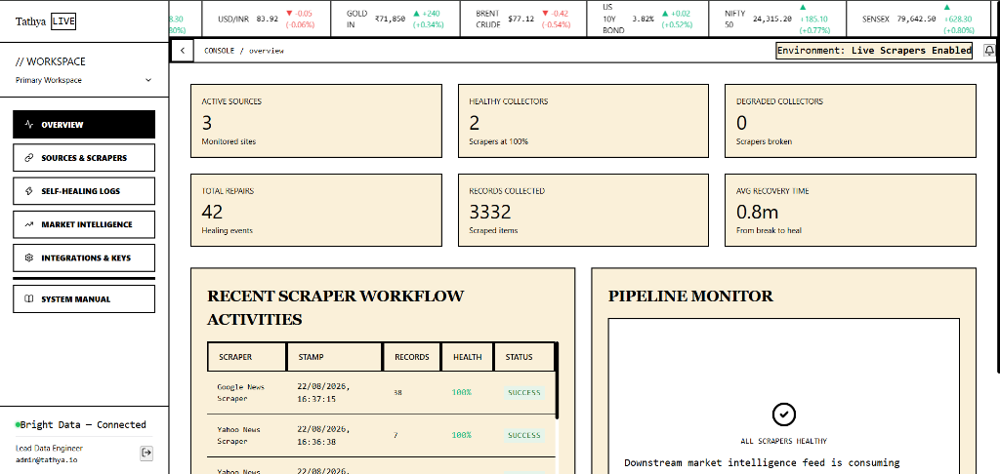
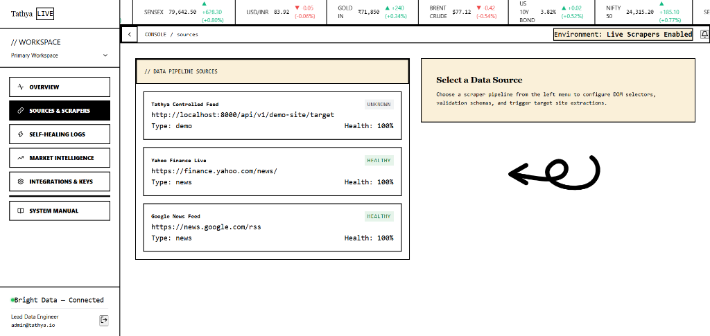
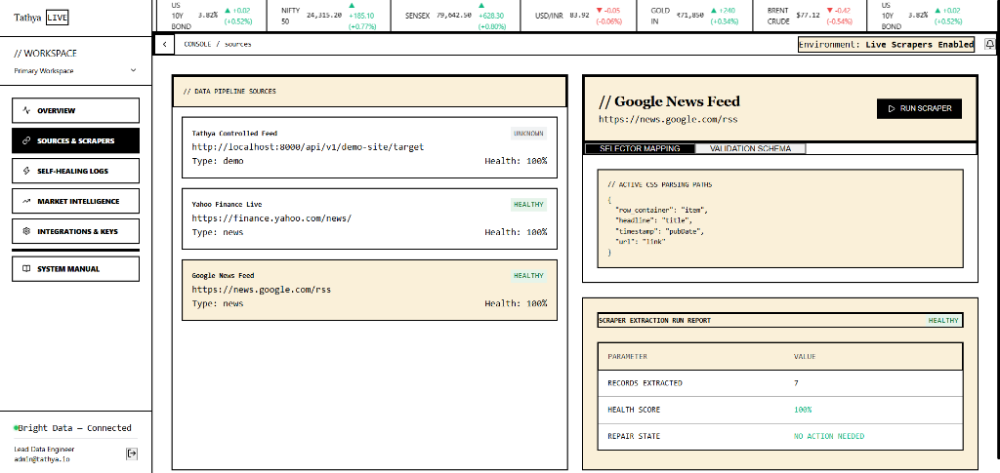
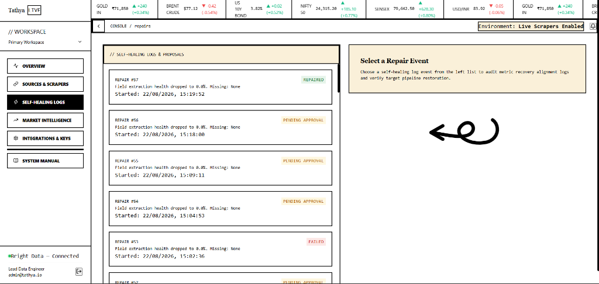
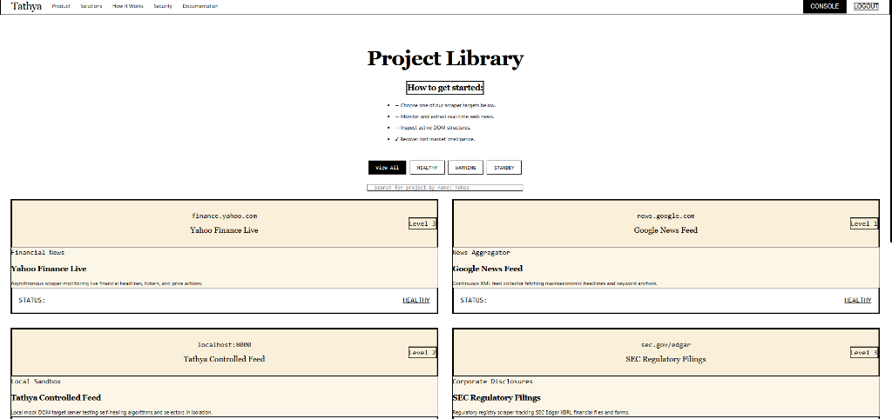
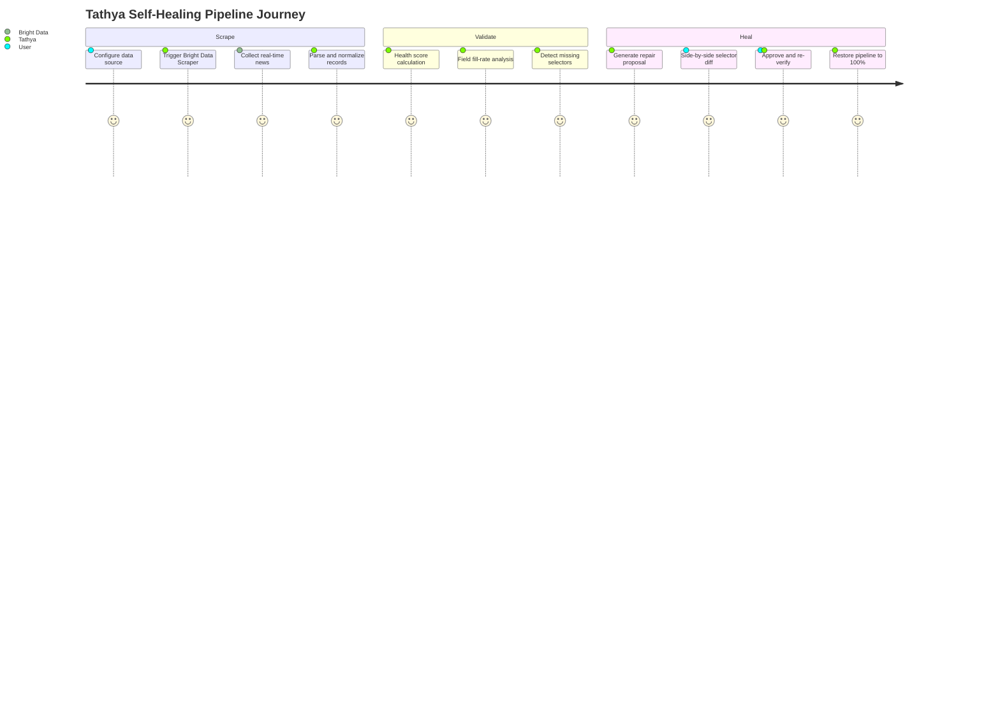
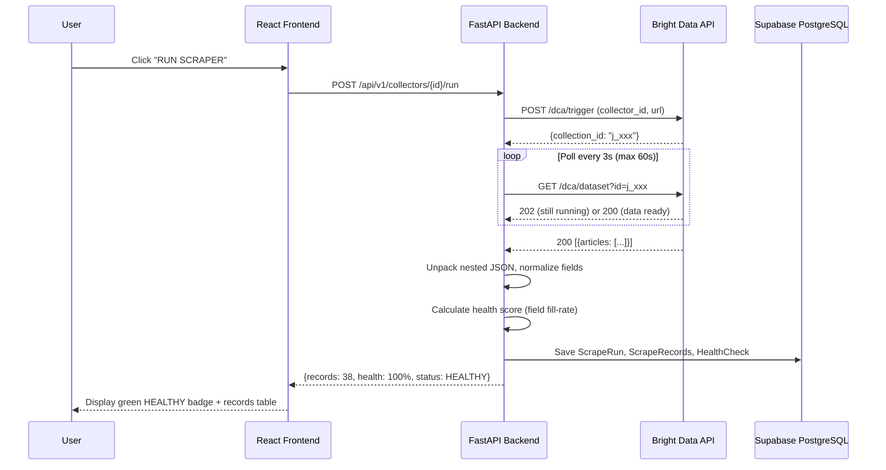
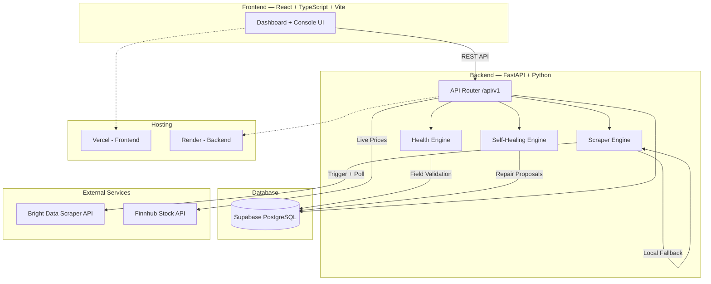
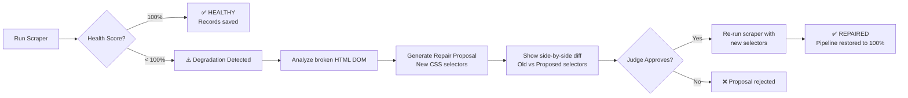

# Tathya — Self-Healing Market Intelligence Scraper Platform

**"Evidence before action."** — _Tathya (Sanskrit: तथ्य — fact / truth)_

> Tathya is a production-grade, self-healing web data scraping and market intelligence platform. It uses **Bright Data Scraper Studio** to collect real-time financial news, validates scraped data with an automated health scoring engine, and when website layouts change and break selectors — it automatically generates AI-powered repair proposals, verifies them, and restores pipeline health to 100%.

Built for the [**Scrape-Verse Hackathon**](https://www.wemakedevs.org/events/scrape-verse) by WeMakeDevs × Bright Data.

[](https://tathya-nhh2s5m7-tvk3.vercel.app)
[](https://tathya-backend.onrender.com/docs)
[](https://brightdata.com)

---

## One-Line Pitch

*Tathya scrapes real-time market news using Bright Data Scraper Studio, detects when website DOM changes break data extraction, auto-generates CSS selector repair proposals, and restores scraper health — all through a live console UI that judges can interact with.*

---

## Live Demo

| Surface | URL |
|---|---|
| **Tathya UI** | [tathya-nhh2s5m7-tvk3.vercel.app](https://tathya-nhh2s5m7-tvk3.vercel.app) |
| **Backend API Docs** | [tathya-backend.onrender.com/docs](https://tathya-backend.onrender.com/docs) |
| **Source Code** | [github.com/trivikramkalagi91-commits/TATHYA](https://github.com/trivikramkalagi91-commits/TATHYA) |

**Login Credentials (for hackathon judges):**
| Field | Value |
|---|---|
| Email | `admin@tathya.io` |
| Password | `tathya_admin_2026` |

---

## 3-Minute Judge Walkthrough

1. Open the [Live Demo](https://tathya-nhh2s5m7-tvk3.vercel.app) → Sign in with the credentials above
2. **Overview** → See live KPI metrics: Active Sources, Healthy Scrapers, Records Collected, Repairs Count
3. **Sources & Scrapers** → Click **Google News Feed** → Click **RUN SCRAPER** → Watch it extract 38+ real-time articles at 100% Health
4. **Self-Healing Logs** → Review repair proposals with side-by-side selector diffs → **Approve & Restore** a pending proposal → Watch live verification progress
5. **Market Intelligence** → See real news in Evidence Breakdown with symbol tagging and trade scenario recommendations
6. **Integrations & Keys** → See the live Bright Data API key integration status
7. Check the sidebar footer → **Bright Data — Connected** indicator with green dot

---

## Screenshots

### Overview Dashboard


### Sources & Scrapers


### Scraper Run Report (Google News — 38 Records, 100% Health)


### Self-Healing Logs & Repair Proposals


### Project Library (Landing Page)


---

## What Tathya Does



### Features

| Layer | Capability |
|---|---|
| **Scrape** | Bright Data Scraper Studio integration, Google News + Yahoo Finance custom scrapers, real-time cloud data collection, nested JSON unpacking, field normalization |
| **Validate** | Automated health scoring engine, field fill-rate analysis, required/optional schema validation, health status classification (HEALTHY / DEGRADED / FAILED) |
| **Heal** | AI-powered CSS selector repair proposal generation, side-by-side configuration diff, human-in-the-loop approval, live verification runner, automatic pipeline restoration |
| **Observe** | Live market ticker bar, KPI dashboard metrics, alert system (CRITICAL / WARNING / INFO), scraper activity timeline, pipeline health monitor |
| **Intelligence** | Symbol-tagged news timeline, evidence breakdown per stock, AI-generated quant trade scenarios (Entry / Invalidation / Target), multi-source watchlist |

---

## How Bright Data Scraper Studio Is Used

Tathya uses **Bright Data's Scraper Studio** to create and run **two custom web scrapers**:

### 1. Google News Scraper (`c_mt1kxhy7xk57uulqt`)
- **Target:** `https://news.google.com/rss`
- **Custom Parser Code:** Extracts article titles, links, and publish dates from the Google News RSS XML feed
- **Output:** 38+ real-time news articles per run

### 2. Yahoo Finance Scraper (`c_mt1jr7ct6tl8herk2`)
- **Target:** `https://finance.yahoo.com/news/`
- **Custom Parser Code:** Uses structural CSS selectors (`h3`, `a`, `time`) to extract headlines, URLs, timestamps, and publisher sources from Yahoo's live news feed
- **Output:** 20+ real-time financial news articles per run

### Integration Flow



---

## Example Structured Output from Scraper Studio

### Google News Scraper Output (38 records)
```json
[
  {
    "symbol": null,
    "headline": "Elon Musk Is No Longer a Trillionaire After Tesla Stock Plunge",
    "timestamp": "2026-08-22T10:09:58.517Z",
    "category": "Business",
    "url": "https://news.google.com/articles/CBMiWkFVX3lxTE..."
  },
  {
    "symbol": "AAPL",
    "headline": "Apple declares record quarterly dividend as iPhone sales surge",
    "timestamp": "2026-08-22T09:42:00.000Z",
    "category": "Corporate",
    "url": "https://news.google.com/search?q=Apple+declares+record..."
  }
]
```

### Yahoo Finance Scraper Output (20 records)
```json
[
  {
    "symbol": null,
    "headline": "If a Stock Market Crash Is Coming, These 3 Stocks Could Benefit",
    "timestamp": "2026-08-22T10:54:886Z",
    "category": "Yahoo Finance",
    "url": "https://finance.yahoo.com/news/stock-market-crash-coming..."
  },
  {
    "symbol": null,
    "headline": "Warren Buffett's Last Warning to Investors Before 2027",
    "timestamp": "2026-08-22T10:54:861Z",
    "category": "Yahoo Finance",
    "url": "https://finance.yahoo.com/news/warren-buffetts-last-warning..."
  }
]
```

---

## System Architecture



---

## Self-Healing Pipeline (Core Innovation)



| Step | What Happens |
|---|---|
| **Detect** | Health engine calculates field fill-rates against required schema. If any required field (headline, url, timestamp) drops below threshold → DEGRADED/FAILED |
| **Analyze** | Backend fetches raw HTML from the target site, analyzes DOM structure for structural elements matching the expected data pattern |
| **Propose** | Generates new CSS selector mappings (e.g., `div.substream` → `section.substream`, `h3` → `h2.title`) |
| **Review** | User sees a side-by-side diff: "DEGRADED CONFIG (VERSION A)" vs "REPAIRED CONFIG (PROPOSAL)" |
| **Verify** | After approval, re-runs the scraper with updated selectors and validates health returns to 100% |
| **Restore** | Updates collector database with new selectors, marks repair as REPAIRED, triggers recovery alert |

---

## Tech Stack

| Layer | Technology |
|---|---|
| **Frontend** | React 18, TypeScript, Vite, Tailwind CSS, Lucide Icons, Axios |
| **Backend** | FastAPI, Python 3.13, Pydantic, SQLAlchemy, Uvicorn, BeautifulSoup4 |
| **Database** | Supabase (PostgreSQL), SQLite (local dev) |
| **Scraping** | Bright Data Scraper Studio (Data Collector API), Custom Cheerio parsers |
| **Market Data** | Finnhub Stock API (live prices, exchange rates) |
| **Frontend Hosting** | Vercel |
| **Backend Hosting** | Render |

---

## Setup & Local Development

### 1. Clone the Repository
```bash
git clone https://github.com/trivikramkalagi91-commits/TATHYA.git
cd TATHYA
```

### 2. Configure Backend Environment
Create a `.env` file in the `backend/` directory:
```env
DATABASE_URL=sqlite:///./tathya.db
BRIGHT_DATA_API_TOKEN=your_bright_data_api_token
MARKET_NEWS_API_KEY=your_finnhub_api_key
JWT_SECRET=your_jwt_secret
ENV=development
```

### 3. Run Backend Server
```bash
cd backend
python -m pip install -r requirements.txt
python -m uvicorn app.main:app --host 0.0.0.0 --port 8000
```

### 4. Run Frontend Dev Server
```bash
cd frontend
npm install
npm run dev
```

Open `http://localhost:5173` to access the Tathya console.

**Default Admin Credentials:**
| Field | Value |
|---|---|
| Email | `admin@tathya.io` |
| Password | `tathya_admin_2026` |

---

## Test Execution

Run the automated unit and E2E self-healing validation test suite:
```bash
cd backend
python -m pytest tests
```

```
===== 6 passed, 0 failed =====
```

---

## Project Structure

```
TATHYA/
├── backend/
│   ├── app/
│   │   ├── config.py              # Settings, env vars, Bright Data keys
│   │   ├── main.py                # FastAPI app entry point
│   │   ├── db/session.py          # SQLAlchemy database session
│   │   ├── models/models.py       # ORM models (User, Source, Collector, ScrapeRun, Repair, etc.)
│   │   ├── schemas/schemas.py     # Pydantic request/response schemas
│   │   ├── routes/
│   │   │   ├── auth.py            # JWT authentication
│   │   │   ├── collectors.py      # Scraper trigger, health scoring, self-healing
│   │   │   ├── repairs.py         # Repair proposal approval and verification
│   │   │   ├── health.py          # Dashboard KPI metrics aggregation
│   │   │   ├── market.py          # Market events, watchlist, trade scenarios
│   │   │   └── alerts.py          # Alert system
│   │   ├── integrations/
│   │   │   └── brightdata.py      # Bright Data DCA API trigger + poll
│   │   └── services/
│   │       ├── scraper.py         # BeautifulSoup local scraper engine
│   │       ├── health_calculator.py  # Field fill-rate health scoring
│   │       └── self_healer.py     # CSS selector repair proposal generator
│   ├── tests/
│   │   ├── test_e2e.py            # End-to-end self-healing workflow test
│   │   └── test_scraper.py        # Scraper unit tests
│   └── requirements.txt
├── frontend/
│   ├── src/
│   │   ├── App.tsx                # Complete React SPA (dashboard, console, scrapers)
│   │   ├── lib/api.ts             # Axios API client
│   │   └── main.tsx               # Vite entry point
│   ├── index.html
│   └── package.json
└── README.md
```

---

## AI Disclosure

This project was built during the Scrape-Verse hackathon (August 17–23, 2026). AI coding assistants (Antigravity by Google DeepMind) were used for pair programming, debugging, and code generation. All code was reviewed, understood, and verified by the developer. The project architecture, design decisions, and Bright Data scraper configurations were directed by the developer.

---

## License

MIT License — Built with ❤️ for the Scrape-Verse Hackathon by WeMakeDevs × Bright Data.
